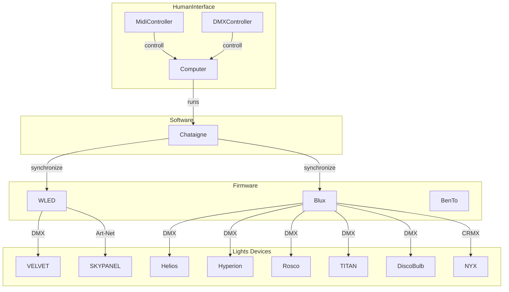

# Lichter

## Software

### ESP32 Firmware

- WLED https://kno.wled.ge

### WLED Interfaces

- E1.31 (DMX)
- Art-Net
- DDP

### To Check

- https://github.com/benkuper/BenTo
- https://benjamin.kuperberg.fr/blux/en
- https://benjamin.kuperberg.fr/chataigne/en
- https://wled.discourse.group/t/wled-chataigne-blux-bento/7738

## High Level Design

## Hardware

| Name                   | Type    | Count      | WLED Compatibel        | Interface           | Pixel | Power                     | Docs                                                                                                           |
| ---------------------- | ------- | ---------- | ---------------------- | ------------------- | ----- | ------------------------- | -------------------------------------------------------------------------------------------------------------- |
| VELVET 1               | fläche  | 2          | :heavy_check_mark:     | DMX                 |       | 12 to 35V DC / 90-264V AC | https://www.velvetlight.tv/product/velvet-light-1/                                                             |
| VELVET 2               | fläche  | 2          | :heavy_check_mark:     | DMX                 |       |                           | https://www.velvetlight.tv/product/velvet-light-2/                                                             |
| SKYPANEL S30-C         |         | 3          | :heavy_check_mark:     | DMX, Art-Net, sACN  |       | 48V                       | https://www.arri.com/en/lighting/led/skypanel/                                                                 |
| SKYPANEL S60-C         |         | 3          | :heavy_check_mark:     | DMX, Art-Net, sACN  |       | 48V                       | https://www.arri.com/en/lighting/led/skypanel/                                                                 |
| SKYPANEL S120-C        |         | 3          | :heavy_check_mark:     | DMX, Art-Net, sACN  |       | 48V                       | https://www.arri.com/en/lighting/led/skypanel/                                                                 |
| SKYPANEL S360-C        |         | 3          | :heavy_check_mark:     | DMX, Art-Net, sACN  |       | 48V                       | https://www.arri.com/en/lighting/led/skypanel/                                                                 |
| Rosco                  | STRIPES |            | :heavy_check_mark:     | DMX                 |       |                           | https://us.rosco.com/en/products/brand/roscoled-tape                                                           |
| Astera NYX             | Bulb    | 20         | :question: (glaube ja) | CRMX (Wireless DMX) | 1     | 5v                        | https://astera-led.com/de/produkte/nyx-bulb/                                                                   |
| Astera TITAN           | Tube    | 24         | :heavy_check_mark:     | DMX                 | 8     |                           | https://astera-led.com/de/produkte/titan/                                                                      |
| Astera Helios          | Tube    | 6          | :heavy_check_mark:     | DMX                 | 16    |                           | https://astera-led.com/de/produkte/helios-tube/                                                                |
| Astera Hyperion        | Tube    | 4          | :heavy_check_mark:     | DMX                 | 32    |                           | https://astera-led.com/de/produkte/hyperion-tube/                                                              |
| QUASAR Crossfade-X 1   |         |            | :x:                    |                     |       |                           | https://www.quasarscience.com/collections/lights/products/crossfade-x                                          |
| QUASAR Crossfade-X 2   |         |            | :x:                    |                     |       |                           | https://www.quasarscience.com/collections/lights/products/crossfade-x                                          |
| QUASAR Crossfade-X 4ft |         |            | :x:                    |                     |       |                           | https://www.quasarscience.com/collections/lights/products/crossfade-x                                          |
| KinfoFlos              |         | :infinity: |                        |                     |       |                           | https://www.lightequip.de/Verbrauchsmaterial/Leuchtmittel/KinoFlo-4ft-Kino-800ma-KF32-Safety-Coated::5528.html |

## Protokolls

- E1.31 (DMX)
- Art-Net
- DDP
- DMX output
-> https://robertoostenveld.nl/art-net-to-dmx512-with-esp8266/

